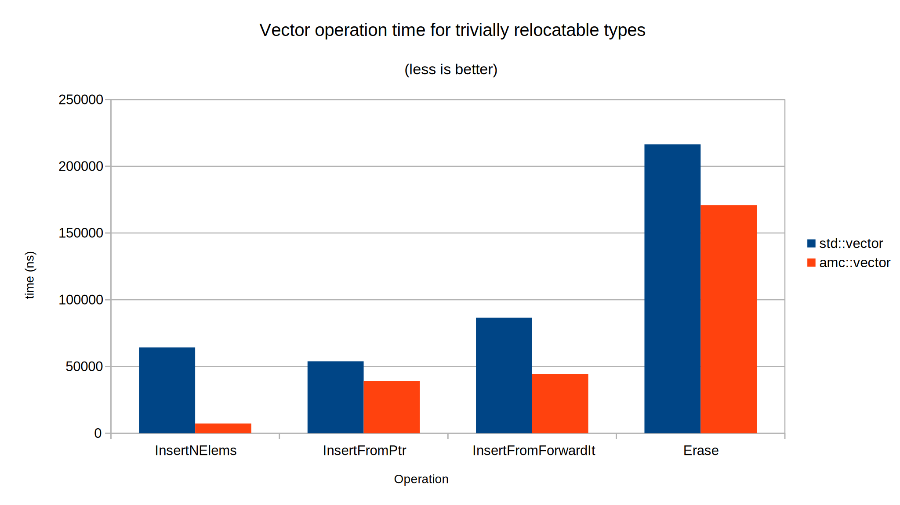
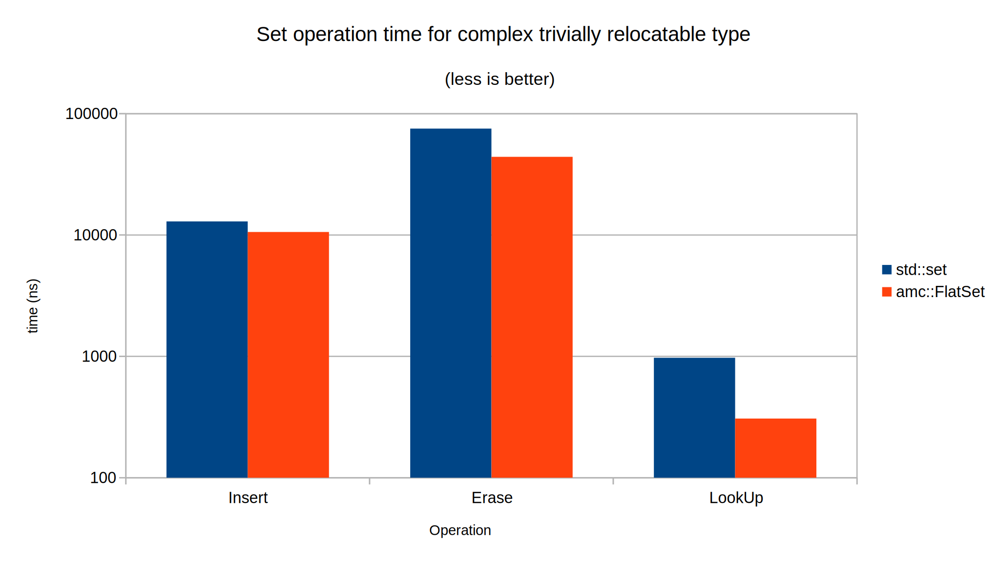
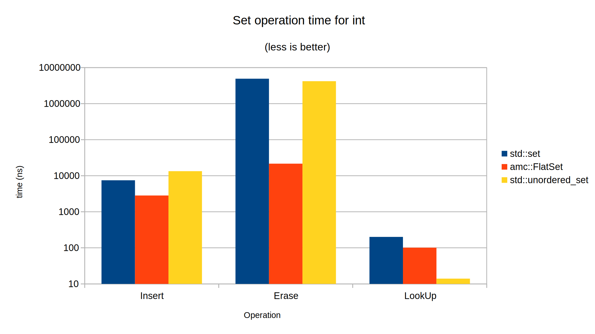

[](https://github.com/AmadeusITGroup/amc/actions/workflows/ubuntu.yml)
[](https://github.com/AmadeusITGroup/amc/actions/workflows/windows.yml)
[](https://github.com/AmadeusITGroup/amc/actions/workflows/macos.yml)

[](https://github.com/AmadeusITGroup/amc/actions/workflows/clang-format-check.yml)

[](https://raw.githubusercontent.com/AmadeusITGroup/amc/master/LICENSE)
[](https://github.com/AmadeusITGroup/amc/releases)

# AMadeus (C++) Containers

<details><summary>Sections</summary>
<p>

- [AMadeus (C++) Containers](#amadeus-c-containers)
  - [Brief](#brief)
  - [Contents](#contents)
  - [Benefits](#benefits)
    - [Performance optimizations](#performance-optimizations)
      - [Vectors](#vectors)
      - [Sets](#sets)
    - [Other benefits](#other-benefits)
      - [For vector types](#for-vector-types)
      - [For FlatSet](#for-flatset)
  - [What is a trivially relocatable type?](#what-is-a-trivially-relocatable-type)
  - [Build with CMake](#build-with-cmake)
    - [Options](#options)
    - [As a main project](#as-a-main-project)
    - [As a sub-project with cmake](#as-a-sub-project-with-cmake)
      - [With FetchContent](#with-fetchcontent)
      - [By installing amc](#by-installing-amc)
    - [Tested environments](#tested-environments)
  - [Usage examples](#usage-examples)
    - [Vectors](#vectors-1)
      - [amc::vector](#amcvector)
      - [SmallVector](#smallvector)
      - [FixedCapacityVector](#fixedcapacityvector)
    - [Sets](#sets-1)
      - [FlatSet](#flatset)
      - [SmallSet (c++17)](#smallset-c17)

</p>
</details>

## Brief

Collection of high performance C++ containers, drop-in replacements for `std::vector` and `std::set`, used in Amadeus pricing and shopping engines instead of standard ones.

## Contents

This header based library (to be more precise, `cmake` interface) provides the following containers:

| Container Name      | STL equivalent | Brief                                                               | Why?                                                         |
| ------------------- | -------------- | ------------------------------------------------------------------- | ------------------------------------------------------------ |
| FixedCapacityVector | std::vector    | Vector-like which cannot grow, max capacity defined at compile time | No dynamic memory allocation                                 |
| SmallVector         | std::vector    | Vector-like optimized for small sizes                               | No dynamic memory allocation for small sizes                 |
| vector              | std::vector    | Vector optimized for trivially relocatable types                    | Optimized for trivially relocatable types                    |
| FlatSet             | std::set       | Set-like implemented as a sorted vector                             | Alternate structure for sets optimized for read-heavy usages |
| SmallSet (\*)       | std::set       | Set-like optimized for small sizes                                  | No dynamic memory allocation and unsorted for small sizes    |

 \*: C++17 compiler only (uses `std::variant` & `std::optional`)

## Benefits

### Performance optimizations

 - For types taking an integral `N` as template parameter, container does not allocate dynamic memory as long as its capacity does not exceed `N`
 - Vectors (and `FlatSet`, as it uses `amc::vector` by default) are all optimized for **trivially relocatable** types (definition below).

Example of possible performance gains (directly extracted from the provided benchmarks, compiled with GCC 10.1 on Ubuntu 18:)

#### Vectors



#### Sets

For sets, time axis is in logarithmic scale.




### Other benefits

 - All 3 vector flavors share the same code / algorithms for vector operations.
 - Templated code generation is minimized thanks to the late location of the integral N template parameter
 - Optimized emulations of standard library features for older C++ compilers are provided when C++ version < C++17

A set of non standard methods and constructors are defined for convenience, provided that `amc` is compiled with `AMC_PEDANTIC` disabled (default, see [Options](#options)).
Here is a brief summary of these extras (compared to their STL equivalents):

#### For vector types
For all vectors (`FixedCapacityVector`, `SmallVector`, `vector`)
| Method         | Description                                                  |
| -------------- | ------------------------------------------------------------ |
| `pop_back_val` | Same as `pop_back`, returning popped value.                  |
| `append`       | Same as `insert(vec.end(), ...)`                             |
| `swap2`        | Swap with all other flavors of vectors, not just `this` type |

For `SmallVector` only, there is a constructor from a rvalue of a `amc::vector` that allows stealing of its dynamic storage.

#### For FlatSet
| Method          | Description                                                                                |
| --------------- | ------------------------------------------------------------------------------------------ |
| `data`          | Returns `data` const pointer from underlying vector                                        |
| `operator[n]`   | Access to the underlying value at position 'n' for the `FlatSet`                           |
| `at(n)`         | Access to the underlying value at position 'n' for the `FlatSet`, throwing if our of range |
| `capacity`      | Calls underlying vector `capacity` method                                                  |
| `reserve`       | Calls underlying vector `reserve` method                                                   |
| `shrink_to_fit` | Calls `shrink_to_fit` of underlying vector                                                 |

There is an additional constructor and assignment operator from a rvalue of the underlying vector type, stealing its dynamic storage.

## What is a trivially relocatable type?

It describes the ability of moving around memory a value of type T by using `memcpy` (as opposed to the conservative approach of calling the copy constructor and the destroying the old temporary). 
It is a type trait currently not (yet?) present in the standard, although is has been proposed (more information [here](https://quuxplusone.github.io/blog/2018/07/18/announcing-trivially-relocatable/)).
No need to use a modified compiler to benefit from trivially relocatibilty optimizations: you can use helper type traits provided by this library to mark explicitely types that you know **are** trivially relocatable. The conservative approach assumes that all trivially copyable types are trivially relocatable, so no need to mark them as such.
With trivially relocatable types, performance gains are easily measurable for all operations of the Vector like container involving *relocation* of elements (grow, insert in middle, etc).

Fortunately, most types are trivially relocatable. `amc::vector` itself is trivially relocatable (as well as `FixedCapacityVector` and `SmallVector` if T is). Types containing pointers to parts of themselves are typically not trivially relocatable, because moving them would require to update the internal pointers they hold to parts of themselves (`std::list`, `std::set`, `std::map` are for instance). `std::string` is not trivially relocatable in some implementations, but some open source equivalents are (for instance, [folly::fbstring](https://github.com/facebook/folly/blob/master/folly/FBString.h)). More information [here](https://quuxplusone.github.io/blog/2019/02/20/p1144-what-types-are-relocatable/).

The most convenient way to mark a type as trivially relocatable is to declare in the public part of the class:

`using trivially_relocatable = std::true_type;`

This is only necessary for non trivially copyable types, because trivially copyable types are trivially relocatable by default.

## Build with CMake

### Options

| CMake flag            | Description                                                                                                        |
| --------------------- | ------------------------------------------------------------------------------------------------------------------ |
| AMC_ENABLE_TESTS      | Build **amc** with unit tests (default if main project)                                                            |
| AMC_ENABLE_BENCHMARKS | Build **amc** with benchmarks against STL (default if main project and Release mode)                               |
| AMC_ENABLE_ASAN       | Build with Address Sanitizer mode (only GCC and Clang)                                                             |
| AMC_PEDANTIC          | If **OFF**, non standard methods and constructors are added for containers (see [Other benefits](#other-benefits)) |

### As a main project

This library is header only library, with one file to be included per container.

Vectors and `FlatSet` containers require a C++11 compiler. 
`SmallSet` however, needs a C++17 compiler because it uses `std::variant` and `std::optional`, although `boost::variant` could be used as a workaround if a C++17 compiler is not available.

Unit tests and benchmarks are provided. They can be compiled with **cmake**. 

By default, both will be compiled only if 'amc' is instantiated as the main project. You can manually force the build of the tests and benchmarks thanks to following `cmake` flags:
```
AMC_ENABLE_TESTS
AMC_ENABLE_BENCHMARKS
```

Bundled tests depend on [Google Test](https://github.com/google/googletest), benchmarks on [Google benchmarks](https://github.com/google/benchmark).

If not installed on your machine, `cmake` will retrieve them automatically thanks to [FetchContent](https://cmake.org/cmake/help/latest/module/FetchContent.html) feature.

To compile and launch the tests in `Debug` mode, simply launch

`mkdir build && cd build && cmake -DCMAKE_BUILD_TYPE=Debug .. && make && ctest`

### As a sub-project with cmake

#### With FetchContent

```
include(FetchContent)

FetchContent_Declare(
  amadeusamc
  GIT_REPOSITORY https://github.com/AmadeusITGroup/amc.git
  GIT_TAG        origin/main
)

FetchContent_MakeAvailable(amadeusamc)
```

Official documentation [here](https://cmake.org/cmake/help/latest/module/FetchContent.html).

By default, `amc` unit tests and benchmarks will not be compiled when used as a sub-project, which is probably what you want. 

`cmake` targets using amc containers can then be linked with the interface library `amc::amc`:
```
target_link_libraries(my_target PRIVATE amc::amc)
```

#### By installing amc

Just use `sudo make install` or `sudo ninja install` depending on your generator to install headers on your machine.

If you plan to use non standard extra features, make sure you add:
```
#define AMC_NONSTD_FEATURES
```

before any include of `amc` headers (it is defined if `AMC_PEDANTIC` CMake flag is `OFF` when building as a main project).

And that's all. You just need to include the corresponding container's header file to be used in your application code, and why not define them in your namespace.

```cpp
#define AMC_NONSTD_FEATURES // If you need non standard features
#include <amc/vector.hpp>
#include <amc/smallvector.hpp>
#include <amc/fixedcapacityvector.hpp>

#include <amc/flatset.hpp>
#include <amc/smallset.hpp> // Requires C++17
#undef AMC_NONSTD_FEATURES

namespace my_namespace {
using amc::vector;
using amc::SmallVector;
using amc::FixedCapacityVector;

using amc::FlatSet;
using amc::SmallSet;
}
```

### Tested environments

This library has been tested on Ubuntu 18.04 and Windows 10 (Visual Studio 2019), from cmake 3.15 and the following compilers:
 - GCC from version 5.5 to 10
 - Clang from version 6.0
 - MSVC 19.28

You can refer to the CI configurations (lots of compilers are tested) to see the full list of tested compilers.

## Usage examples

### Vectors 

#### amc::vector

`amc::vector` can be used as drop-in replacement for `std::vector`, especially when the underlying type is *trivially relocatable*.
If your type is *trivially copyable*, optimizations are automatically activated.
If your type is not trivially copyable but is *trivially relocatable*, make sure to mark it as such to activate optimizations.

```cpp
#include <amc/vector.hpp>

struct MyTriviallyRelocatableType {
  MyTriviallyRelocatableType() {}

  // MyTriviallyRelocatableType is not trivially copyable...
  ~MyTriviallyRelocatableType() { free(ptr); }

  //... but trivially relocatable!
  using trivially_relocatable = std::true_type;

  void *ptr{};
};

using MyTriviallyRelocatableTypeVector = amc::vector<MyTriviallyRelocatableType>;
```

#### SmallVector

Special variation of `amc::vector` which does not allocate memory and store objects inline up to a maximum capacity defined at compile-time.
If `SmallVector` has to grow beyond this upper bound capacity, it will behave like a `amc::vector` by allocating dynamic memory.
Once a `SmallVector` has allocated dynamic memory, it will not release its memory and come back to its 'small' state when its size goes back under the maximum inline capacity, unless `shrink_to_fit` is called.

Use it when most of the time (let's say, for instance, in 90 % of the cases) the maximum size of the `SmallVector` does not exceed a compile-time constant to save memory allocations.

```cpp
#include <amc/smallvector.hpp>

using ResidencesOfUser = amc::SmallVector<Residence, 1>;
```

#### FixedCapacityVector

Use it when in your application constraints define a compile-time upper bound of the maximum size of your vector.
Elements are stored inline in the object and no memory allocation occur.

```cpp
#include <cstdint>
#include <amc/fixedcapacityvector.hpp>

using SoldUnitsPerDayInMonth = amc::FixedCapacityVector<int, 31>;
```

In the unlikely event that the vector attempts to grow beyond its maximum capacity, behavior can be controlled thanks to the third template parameter `GrowingPolicy`:
 - `ExceptionGrowingPolicy`: throw `std::out_of_range` exception (default)
 - `UncheckedGrowingPolicy`: assert check (nothing is done in `Release`, invoking undefined behavior, abort will be called in `Debug`).

Compared to a `SmallVector` that would never grow, `FixedCapacityVector` will be slightly more efficient (less checks) and make the intent clear, with nice additional iterator validity properties (`begin()` is never invalidated, iterators before any insert / erase are never invalidated).
In addition, if type is trivially destructible, `FixedCapacityVector` will be itself trivially destructible.

### Sets

#### FlatSet

Also sometimes called `SortedVector`, it uses a sorted `amc::vector` as storage (by default, provided as template type) and is thus cache friendly and memory efficient set-like container.
It can be used as a drop-in replacement for `std::set` especially when the read operations occur much frequently than the writes.
Even if there are a lot of writes, it is still very efficient for *trivially relocatable* types as it uses `amc::vector` by default which relocates elements very efficiently.

Besides, the vector container is templated and thus can be combined with above vectors variations to optimize memory allocations (`SmallVector` or `FixedCapacityVector`).

```cpp
#include <cstdint>
#include <amc/fixedcapacityvector.hpp>
#include <amc/flatset.hpp>

using CapitalLettersSetCont = amc::FixedCapacityVector<char, 26>;
using CapitalLettersSet = amc::FlatSet<char, std::less<char>, CapitalLettersSetCont::allocator_type, CapitalLettersSetCont>;
```

#### SmallSet (c++17)

Additional variation of `std::set` like container. This one has a hybrid behavior similar to `SmallVector`:
 - In its 'small' state, there is no dynamic allocation and elements are stored unordered in an inline vector
 - In its large state, `SmallSet` uses the templated provided Set type. It is a `std::set` by default, but it could be any type which provides a set like interface, like `FlatSet` for instance. In this case, `SmallSet` iterators are optimized into pointers.

Note that insertions have linear complexity in the small state so the inline capacity should not be too large.

```cpp
#include <amc/fixedcapacityvector.hpp>
#include <amc/flatset.hpp>
#include <amc/smallset.hpp>

using VisitedCountries = amc::SmallSet<Country, 5>;
using VisitedCities = amc::SmallSet<City, 20, std::less<City>, amc::allocator<City>, amc::FlatSet<City>>;
```